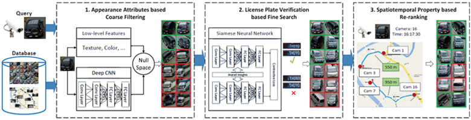

&ensp;

## Abstract
Compared with person re-identification, which has concentrated attention, vehicle re-identification is an important yet frontier problem in video surveillance and has been neglected by the multimedia and vision communities. 
Since most existing approaches mainly consider the general vehicle appearance for re-identification while overlooking the distinct vehicle identifier, such as the license number plate, they attain suboptimal performance. 
In this paper, we propose PROVID, a PROgressive Vehicle re-IDentification framework based on deep neural networks. 
In particular, our framework not only utilizes the multi-modality data in large-scale video surveillance, such as visual features, license plates, camera locations, and contextual information, but also considers vehicle re-identification in two progressive procedures: coarse-to-fine search in the feature domain, and near-to-distant search in the physical space. 
Furthermore, to evaluate our progressive search framework and facilitate related research, we construct the VeRi dataset, which is the most comprehensive dataset from real-world surveillance videos.
It not only provides large numbers of vehicles with varied labels and sufficient cross-camera recurrences but also contains license number plates and contextual information. 
Extensive experiments on the VeRi dataset demonstrate both the accuracy and efficiency of our progressive vehicle re-identification framework.

## VeRi dataset
To facilitate the research of vehicle re-identification (Re-Id), we build a large-scale benchmark dateset for vehicle Re-Id in the real-world urban surveillance scenario, named "VeRi". The featured properties of VeRi include:
* It contains over 50,000 images of 776 vehicles captured by 20 cameras covering an 1.0 km^2 area in 24 hours, which makes the dataset scalable enough for vehicle Re-Id and other related research. 
* The images are captured in a real-world unconstrained surveillance scene and labeled with varied attributes, e.g. BBoxes, types, colors, and brands. So complicated models can be learnt and evaluated for vehicle Re-Id.
* Each vehicle is captured by 2 ∼ 18 cameras in different viewpoints, illuminations, resolutions, and occlusions, which provides high recurrence rate for vehicle Re-Id in practical surveillance environment.
* It is also labeled with sufficient license plates and spatiotemporal information, such as the BBoxes of plates, plate strings, the timestamps of vehicles, and the distances between neighbouring cameras.

&ensp;&ensp;

### Download
To encourage related research, we will provide the dataset according to your request. 
Please email your full name and affiliation to the contact person (*xinchenliu at bupt dot edu dot cn*). 
We ask for your information only to make sure the dataset is used for non-commercial purposes. 
We will not give it to any third party or publish it publicly anywhere.
*Due to the privacy issue we will not provide the license plates in the future.*

## Papers
If you use the dataset, please kindly cite the following paper:
* Xinchen Liu, Wu Liu, Tao Mei, Huadong Ma: **PROVID: Progressive and Multimodal Vehicle Reidentification for Large-Scale Urban Surveillance. IEEE Trans. Multimedia** 20(3): 645-658 (2018) (Citation=33)
* Xinchen Liu, Wu Liu, Tao Mei, Huadong Ma: A Deep Learning-Based Approach to Progressive Vehicle Re-identification for Urban Surveillance. ECCV (2) 2016: 869-884 (Citation=61)
* Xinchen Liu, Wu Liu, Huadong Ma, Huiyuan Fu: Large-scale vehicle re-identification in urban surveillance videos. ICME 2016: 1-6 (**Best Student Paper Award**, Citation=81)

## Application
One US patent, ‘Progressive vehicle searching method and device’ (US 15350813), was granted in 2018. 

This technique has been applied to the Intelligent Transportation Big Data Platform of Beijing Boyotod Technology Co., Ltd. (the subsidiary technical corporation of Beijing Capital Highway Development Group Co., Ltd.).
It has been deployed on several expressways including the G1 Jingha Expressway, the G6 Jingzang Expressway and the S12 Airport South Expressway.

## Codes
Here we give a simple example [code](https://github.com/lxc86739795/vehiclereid_baseline) for training and evaluation on the VeRi dataset.

The complete code and models will be updated soon.
